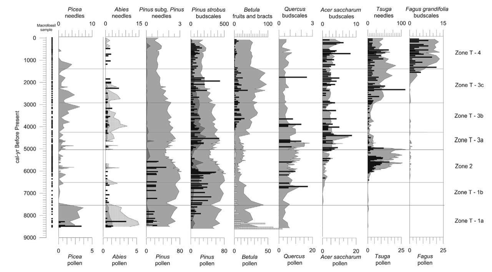
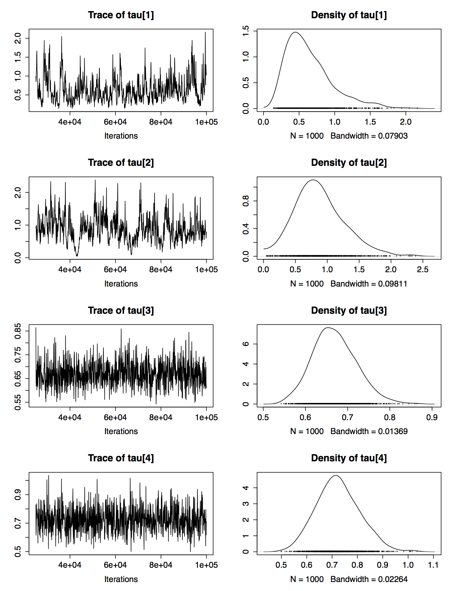
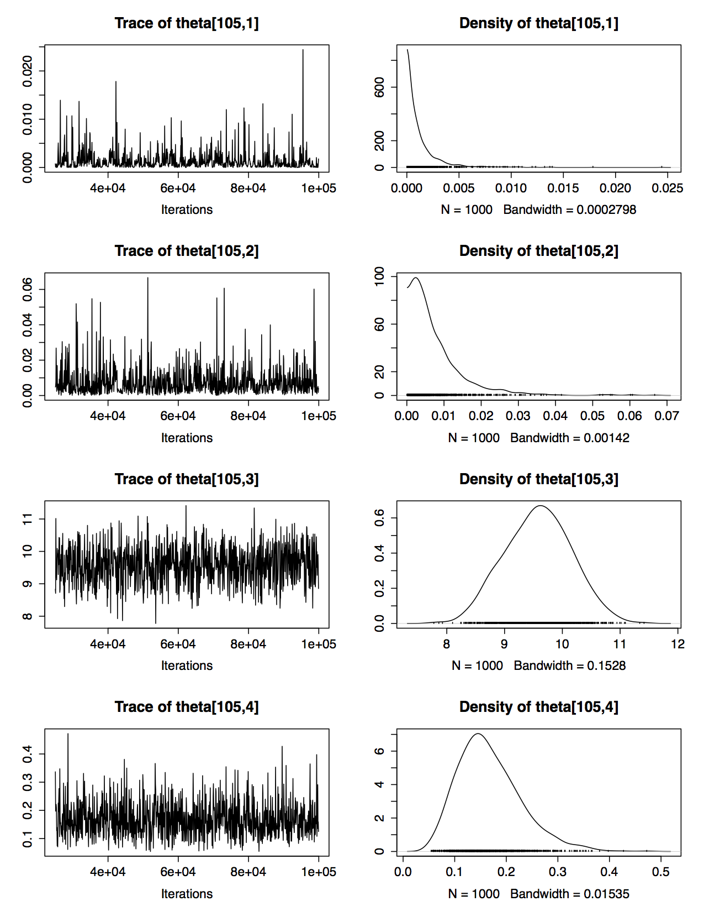
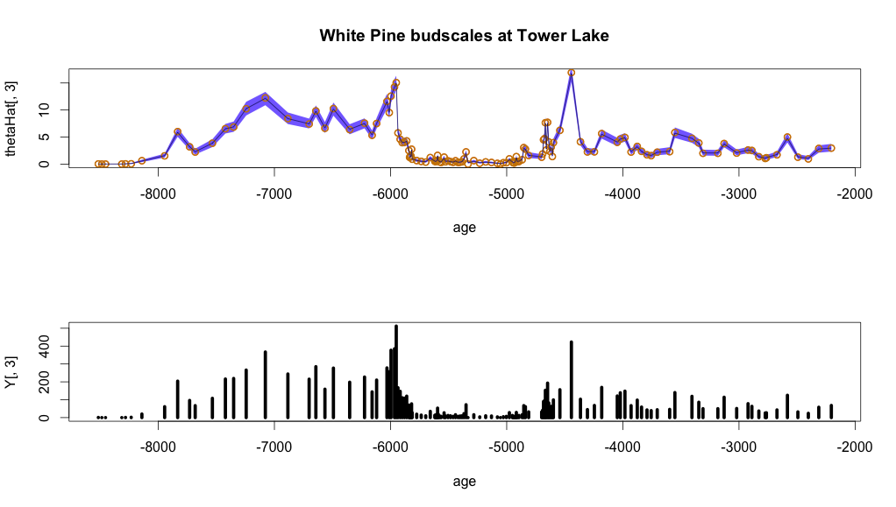
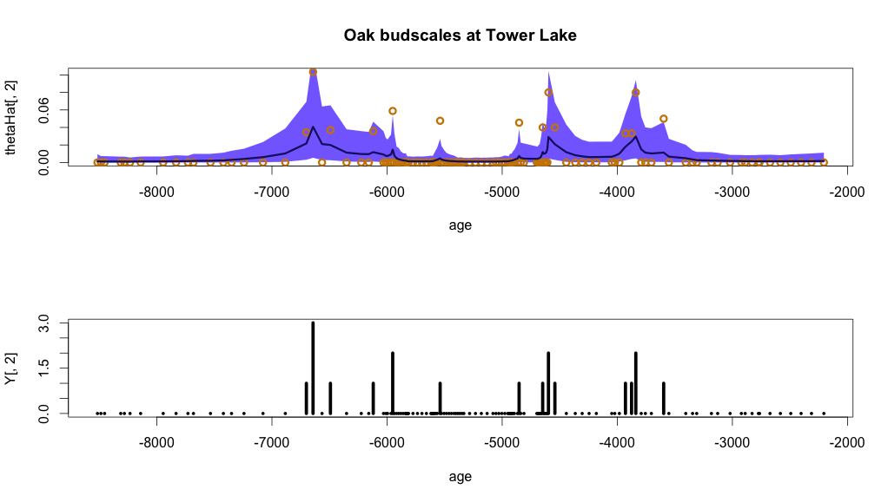
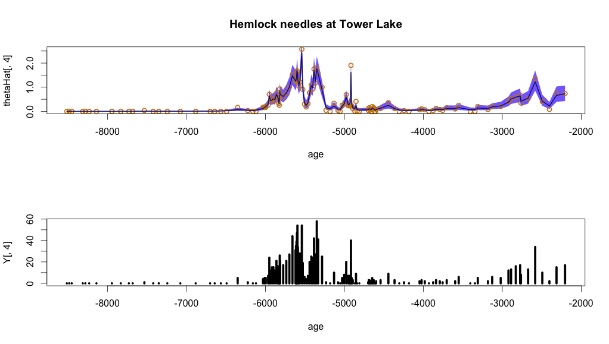

**Tower Lake Record** 
Jackson, et al. 2014 QSR


Want to model the plant macrofossil counts in a way that is analagous to how we modeled pollen earlier this week. 

The data are plant macrofossil counts for a given species and fossil type at each time step - $y_{t}$ - and sample volumes - $v_{t}$. 

## Some EDA

```{r , echo =FALSE,  fig.width=10}

tower <- read.csv("./data/TowerCore1Macros.csv")
tower <- tower[1:131,]
maple <- tower$Acersacbud
oak <- tower$Quercusbud
whitePine <- tower$Pinstbud
hemlock <- tower$TSCAneedle
macros <- cbind(maple, oak,whitePine,hemlock)
depth <- -tower$depth
age <- round(-tower$age,0)
vols <- tower$volume


par(mfrow=c(2,4))
hist(maple)
hist(oak)
hist(whitePine)
hist(hemlock)

maplefit <- rpois(sum(maple), lambda = mean(maple))
hist(maplefit)
oakfit <- rpois(sum(oak), lambda = mean(oak))
hist(oakfit)
pinefit <- rpois(sum(whitePine), lambda = mean(whitePine))
hist(pinefit)
hemlockfit <- rpois(sum(hemlock), lambda = mean(hemlock))
hist(hemlockfit)
```

Time series form:

```{r, echo=FALSE, fig.width=10, fig.height=3}

plot(age, maple, type="h", lwd = 5)
title("Maple Budscales")

plot(age, oak, type="h", lwd = 5)
title("Oak Budscales")

plot(age, whitePine, type="h", lwd = 5)
title("White Pine Budscales")

plot(age, hemlock, type="h", lwd = 5)
title("Hemlock Needles")

```

## The Model

A simple hierarchical model

Since we have count data a Poisson distribution is a simple and natural choice, but the macrofossil data are definitely overdispersed.

$$
y_{t} \sim \mbox{Pois}(M_{t})
$$
$$
M_{t} = \theta_{t}V_{t}
$$
$$
log(M_{t}) = log(\theta_{t}) + log(V_{t})
$$
$$
log(\theta_{t}) \sim N(log(\theta_{t-1}), \tau^{2})
$$
$$
\tau^{2} \sim \mbox{unif}(0,100)
$$


Latent: $\theta_{t}$ is the true macrofossil count per unit volume


### Used JAGS to sample from the model
```{r model specification, eval=FALSE}
Y <- macros
V <- vols
nT <- nrow(Y)
nTypes <- ncol(Y)

macroHMM <- function(){
  
  # priors
  for (i in 1:nTypes){
    tau[i] ~ dunif(0,100)
    tau2Inv[i] <- 1/(tau[i]**2)
    logTheta[1,i] ~ dnorm(0, 0.0001)
    
    #latent
    for (t in 2:nT){
      logTheta[t,i] ~ dnorm(logTheta[t-1,i], tau2Inv[i])
    }
  
    
    # data level
    for (t in 1:nT){
      M[t,i] <- exp(logTheta[t,i])*V[t]
      Y[t,i] ~ dpois(M[t,i])
      
      theta[t,i] <- exp(logTheta[t,i])
    }
  }
}


```


### Diagnostics on the MCMC
#### Note: Malcolm objects to showing these
I had one chain of 100,000 iterations with a burn in of 25,000 iterations. Everything seems to have converged and mixed pretty well. 


Trace plot for the taus


Trace plot for a few thetas



### Results







### Next Steps

* Try different distribution on the Data: $y_{t}$s that accounts for the overdispersion? 

* more complex distribution for the mean of the $\theta{t}$'s perhaps like the one from the pollen model with an overall mean and an autocorrelation that is a hyperparameter, which looked like this for pollen:
$$ 
\mbox{logit}(\theta_t)  \sim  N(\mu + \rho (\mbox{logit}(\theta_{t-1}) - \mu), \tau^2)
$$
* jointly model pollen and macrofossils? have to consider how to construct the latent process in a way that can be shared between the two different observations
*  


  


